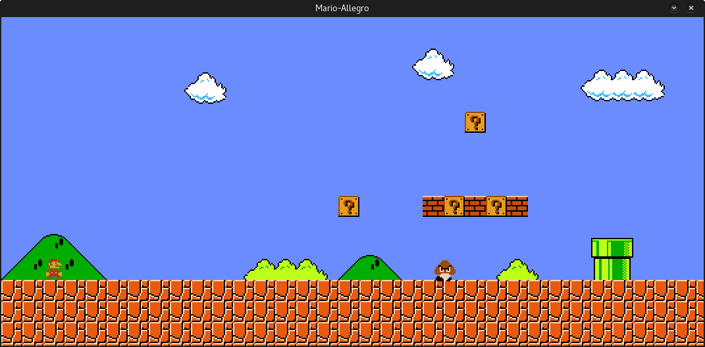

# Super Mario In Allegro C++

This project is the final project of Course **Advanced Programming**. I wrote this game using **Allegro** library in the 2nd semester.

### Install
Before running the game, you need to install [**Qt 5**](https://www.qt.io/download-open-source/) and [**Allegro 5**](https://wiki.allegro.cc/index.php?title=Getting_Started#Installing_Allegro). Click on the links or use your package manager to install them. Then:

```bash
git clone https://github.com/alirezaomidi/SuperMario-Allegro-Cpp
cd SuperMario-Allegro-Cpp/
qmake && make
```

### Running
```bash
build/Mario-Allegro
```



I remember it had no bugs as I was presenting it to my teacher but now, after 2 years, it has lots of bugs. Don't know why :D

Anyway... Enjoy :)

### License

This project is licensed under [MIT](LICENSE) Public License.
